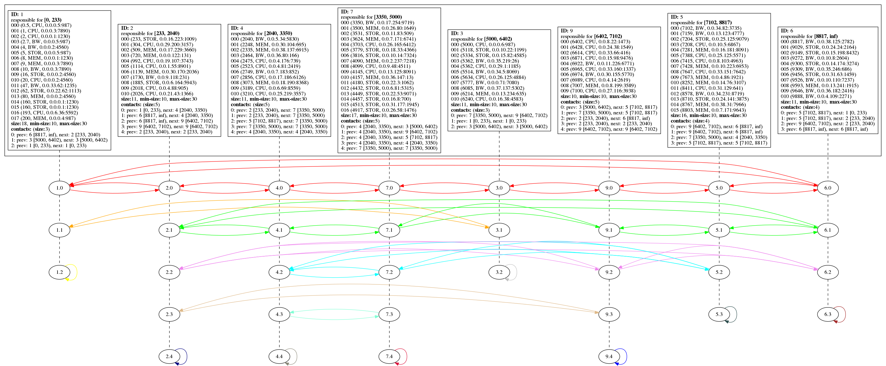

# PacketSkip:

## Skip Graph for Multidimensional Search in Structured Peer-to-Peer Systems

PacketSkip describes an efficient distributed indexing service for structured peer-to-peer systems and IoT 
networks with similar properties. PacketSkip has a couple of unique features:

*  Skip Graph based
*  support for multidimensional data objects
*  ordered structure (in contrast to hashing based lookups)
*  support for range queries
*  efficient lookup in *log n*
*  self organizing
*  scalable and dynamic
*  robust against churn

The original use case for this index was the need of a lookup table for strong, high capacity nodes in a 
heterogeneous peer-to-peer network. Such nodes are more suitable for providing demanding peer-to-peer services,
yet popular P2P overlays such as Chord or Pastry are not capable of providing a sorted index due their hashing
based nature. However, PacketSkip as a service for DHT networks has the potential for many more interesting 
applications for data with an ordinal sequence.

### Publications

PackSkip is described in details in the following two papers:

* **A. Disterhöft, A. Funke, K. Graffi**: *PacketSkip: Skip Graph for Multidimensional Search in Structured 
  Peer-to-Peer Systems*. IEEE 11th International Conference on Self-Adaptive and Self-Organizing Systems (SASO 2017)  
  https://ieeexplore.ieee.org/document/8064026

  **Abstract:**  
  *The Internet is ubiquitous and nodes participating in it are becoming increasingly diverse and heterogeneous. 
  Especially is this true in decentralized, overlay-based networks, which traditionally build upon the infrastructure 
  of the Internet. An ability to search for nodes with specific capabilities becomes of growing interest, for example, 
  to support the node capacity discovery in large scale, distributed networks, such as in peer-to-peer systems. With 
  PacketSkip, we propose a distributed, ordered, multidimensional indexing structure based on a Skip Graph, which 
  operates on top of popular distributed hash tables. Its purpose is to offer, among other functions, capacity-based, 
  high dimensional range searches for peers and their dynamiccapacities. PacketSkip provides a very high search 
  performance, also in comparison to other approaches, as well as low update and maintenance costs. Evaluations show 
  that update and search durations are low and well scalable. Even in dynamic systems, its inner graph structure remains 
  robust and stable.*

* **A. Funke**: *PacketSkip Revisited: Efficient Retrieval of Node Capabilities in Heterogeneous P2P Networks*.
  Course paper for "Opportunistic and Peer-to-Peer Networks" (HHU 2017)  
  [HHU_2017SS_Opp-P2P-Networks___Andreas-Funke___PacketSkip.pdf](paper/HHU_2017SS_Opp-P2P-Networks___Andreas-Funke___PacketSkip.pdf)

  **Abstract:**  
  *In modern miscellaneous peer-to-peer (p2p) networks, combining desktop computers and mobile devices, the homogeneous 
  roles of peers clash with the heterogeneous capabilities of their hosts. Therefore, advanced p2p systems try to 
  allocate heavier load to stronger peers. Identifying and indexing peers by their capacities is an ongoing research. 
  Recently, we have proposed PacketSkip, a Skip Graph based, ordered indexing structure, that provides multidimensional 
  range queries for multi-featured peer capacities. PacketSkip can be added as an additional layer to any DHT-based 
  p2p-overlay. Although its storage demands are already low, storage and update traffic scalability was still of 
  concern for high-dimensional data. Also, the index uses the overlay's lookup mechanism which adds the networks lookup 
  complexity as a factor to its communication's running time.  
  In this paper, we propose several efficiency optimizations for the PacketSkip protocol which help to reduce storage 
  and traffic costs by avoiding to send and store redundant information. These mechanisms are approximately halving the 
  storage and update traffic costs as evaluation shows. Furthermore, we were able to clearly enhance traffic speed by 
  caching host information of PacketSkip nodes, and thereby avoiding frequent p2p-lookups.*

### Implementation

The implementation is composed of two parts running on each node a network:

1. The PacketSkip service

2. The Capacity Manager

#### The Capacity Manager

The capacity manager is an application that regularly propagates the node's capacities to the service
and is also capable of sending queries to the index to retrieve other nodes with certain properties.
The capacity manager is just an example for an application that can leverage PacketSkip.
   
   
#### The PacketSkip Service

While every node in a network may run the PacketSkip service, not all nodes are necessarily part of the skip graph.
In fact skip graph nodes are virtual nodes and one physical network node may host several skip graph nodes with
a certain probability.

The ratio of network nodes and skip graph nodes is determined by the following factors:

1. size of the local index tables
2. data points in the index
3. dimensionality of each data point

The tasks managed by the PacketSkip service are different for physical and virtual nodes.

**Tasks for network nodes:**

* sending messages to the skip graph (updates and queries)
* support for bootstrapping 
* listening for join requests

**Tasks for skip graph nodes:**

* maintaining an index table
* responding to and greedily forwarding update and query messages
* locally maintaining the skip graph by composing and forwarding join and maintenance messages

#### PeerfactSim

[PeerfactSim](https://peerfact.com/) is an open source peer-to-peer simulator for scientific research written
in Java. PacketSkip is implemented as an addon to PeerfactSim using it's underlying P2P overlay implementations
and simulated network traffic including probabilistic churn behaviour.

This repository contains only the code for the PacketSkip service and the Capacity Manager.
It can not be run on its own.

PacketSkip was developed on a fork of PeerfactSim that is maintained by the 
[Technology of Social Networks Lab](https://www.tsn.hhu.de/en.html) of the University of Düsseldorf.
It may not be fully compatible with the publicly available branch.
 

### Measurement Data

* *PacketSkip: Skip Graph for Multidimensional Search in Structured Peer-to-Peer Systems*  
  https://www.dropbox.com/s/sll8j7er18b3u2i/measurement_data1.zip

* *PacketSkip Revisited: Efficient Retrieval of Node Capabilities in Heterogeneous P2P Networks*  
  https://www.dropbox.com/s/l7wq06r3s7amd27/measurement_data2.zip
